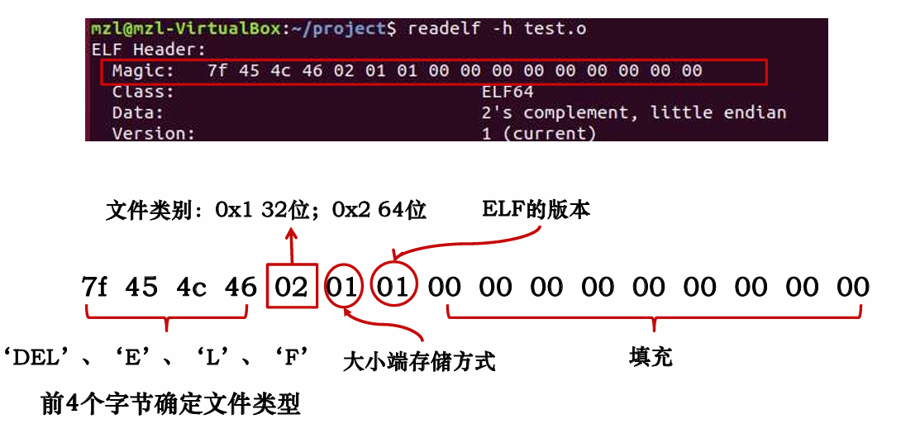
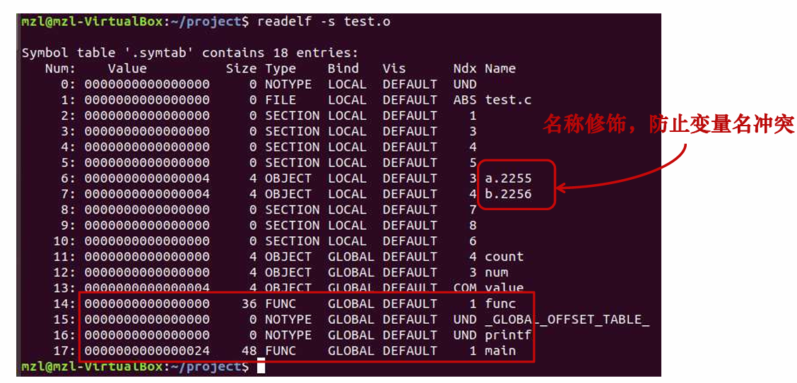

# 第七章 链接

## 1. 链接的基础与目标文件格式

### 1.1.1 从源文件到可执行文件：预处理、编译、汇编、链接

当编写一个 C 程序时，最终目标是生成一个可执行文件，它包含多个步骤

1. 预处理 （Preprocessing）

   处理源代码中的宏定义、头文件等指令，生成 **.i** 后缀的文件，这个阶段输出的知识文本文件

2. 编译（Compilation）

   将预处理后的文件转为汇编语言（**.s** 文件）

   这时候的文件已经是平台相关的汇编指令，但还没有被转换为机器码

3. 汇编（Assembly）

   汇编阶段会将 **.s** 文件转化为机器码生成的可重定位文件（**.o** 文件）

   这个目标文件是一个二进制文件，但不能直接运行，它包含了一些程序的代码和一些未解决的符号

4. **链接（Linking）**

   链接阶段将多个目标文件（**.o** 文件）和必要的库文件（如静态库 **.a** 或动态库 **.so**）链接成一个完整的可执行文件。链接器会解决符号引用（如函数和变量的引用），并将它们重新映射到内存中的具体地址。最终输出的是一个可执行文件（如  **a.out**  或其他指定的名称）

### 1.1.2 可执行和可链接格式（Executable and Linkable Format，ELF）

三类目标文件：

1. 可重定位目标文件（**.o**）
2. 可执行的目标文件（**a.out**）
3. 共享目标目标文件（**.so**）

一个**ELF**文件通常包含以下几个部分：

1. **ELF Header**：包含文件的基本信息，如文件类型，机器架构，版本等

   

2. **Section Header Table**：记录了每个**Section**的起始偏移、大小信息、利用该信息可构建**Section**区域

3. **Section**：实际的代码和数据存储位置

常见的**Section**

1. **.text**：存放程序的机器代码，所有函数的指令都会放在这个节中
2. **.data**：已初始化的全局变量和静态变量，它们的数据在启动时就已经存在
3. **.bss**：未初始化（或初始化为 **0** ）的全局变量和静态变量，有**Section Header**但不在**Section**占空间
4. **.rodata**：存放只读数据，例如 **printf()** 中输出的字符串、跳转表等
5. **.symtab**：函数和全局变量名
6. **rel.text**：可重定位代码
7. **rel.data**：可重定位数据
8. **debug**：调试
9. **line**：源代码行号和机器指令之间的映射
10. **strtab**：一个字符串表，程序中用到的符号的名字

### 1.1.3 符号表和符号类型

每个**.o**文件中都有一个符号表（**.symtab**），包含文件定义和引用的符号信息



#### 三类符号：

1. 全局符号：由该.o文件定义，可被其它文件引用的符号。如非静态的函数和全局变量
2. 外部符号：由该.o文件引用，但被其它文件定义的符号
3. 本地/局部符号：由该.o文件定义，且只能够被该.o文件引用的符号

需要注意的是，程序中的局部变量由编译器管理，链接器不知道，因此它不是符号

#### 链接器解析多重定义的全局符号

程序中的符号可以分为**强符号**和**弱符号**

1. **强符号**：函数和初始化的全局/静态变量
2. **弱符号**：未初始化的全局/静态变量

解析多重符号的时候，遵循以下规则：

1. **不允许多个同名的强符号**：每个强符号只能出现一次，否则链接器错误
2. **若有一个强符号和多个弱符号同名，选择强符号**：对弱符号的引用解析为强符号
3. **若有多个弱符号同名，选择任意一个**

例子1：

```cpp
/** foo3.c **/ 
#include <stdio.h>
 void f();
 int x=15213;
 int main(){
 	f();
 	printf(“x=%d\n”,x)
 	return 0;
 }
```

```cpp
/*bar3.c*/
int x ;

void f(){
	x = 15212 ;
}
```

输出 **x = 15212**

例子2：

```cpp
/** foo4.c **/ 
#include <stdio.h>
 void f();
 int x;
 int main(){
 	f();
 	printf(“x=%d\n”,x)
 	return 0;
 }
```

```cpp
/* bar4.c*/
int x ;

void f(){
	x = 15212 ;
}
```

例子3：

```cpp
/*foo5.c*/
#include <stdio.h>
void f();

int x=15213, y=15212;

int main(){
	f();
	printf(“address of x and y are %p , %p\n”,&x,&y);
	printf(“x=0x%x y=0x%x \n”,x, y) ;
	return 0;
}
```

```cpp
 /*bar5.c*/
double x ;

void f(){
	x = -0.0;
}
```

**double x**的复制会覆盖内存中强符号int x 和 y 所在位置的值

为了避免上述的麻烦，推荐

1. 使用**static**
2. 定义了全局变量就初始化它
3. 引用了外部符号就使用**extern**标识

## 2. 链接器的工作机制：符号解析和重定位

### 1.1.1 符号解析

符号解析时，链接器按照命令行中的输入顺序扫描.o文件和.a文件

扫描过程中维护的3个集合

1. **E**：可重定位目标文件的集合（E中文件最终被合并为可执行文件）
2. **U**：未解析的符号的集合（引用但还没有定义的符号）
3. **D**：在之前的输入文件中已经定义的符号

扫描结束后，如果U为空，合并E 的文件得到可执行目标文件。否则，发出链接错误

**命令行中输入文件的顺序很重要，准则是：将库文件放在末尾**

### 1.1.1 重定位机制

#### 重定位是什么？

重定位就是在目标文件中，将“地址占位符”替换为“真实地址”

#### 为什么需要重定位？

一个.o文件中，代码和数据都是以**相对地址（偏移）**来写的，没办法直接执行

#### 重定位步骤

1. 符号定义重定位

   把所有.o文件中的段（.text、.data)拼起来，分配地址给符号

2. 符号引用重定位

   找出代码中对这些符号的“引用”，修改为真实地址

#### 重定位表如何记录这些引用？

```cpp
struct Elf64_Rela {
    offset   // 这个引用在.text里的偏移
    symbol   // 要引用的符号是哪个
    type     // 是PC相对还是绝对地址, 相对地址R_X86_64_PC32，绝对地址R_X86_64_PLT32/32
    addend   // 补偿偏移
}
```

记录在.rel.text和.rel.data
