# 第五章 优化程序性能(1)

## 本章概述

### 代码优化级别

1. 算法 + 数据结构（选择一组适当的算法和数据结构）
2. 代码级别优化（编写执行高效的代码）
3. 机器级优化（针对运算量大的计算，分为多个子任务，子任务利用多核/多处理器并行计算）

### 普遍有用的代码级优化方法

 核心思想：减少/消除不必要的工作（函数调用、重复运算、条件测试、内存引用等）

#### 代码移动

若计算总是产生相同的结果，可将其从循环中移出，减少计算执行的频率

```cpp
void set_row(double *a, double *b, long i, long n){
	long j;
	for (j = 0; j < n; j++)
		a[n * i + j] = b[j];
}
```

优化为：

```cpp
void set_row(double *a, double *b, long i, long n){
	long j;
    int ni = n * i;
	for (j = 0; j < n; j++)
		a[ni + j] = b[j];
}
```

#### 复杂运算简化

核心思想：用更简单的方法替换昂贵的操作（使用移位、加，替换乘法和除法）

1.乘法转为移位

```cpp
16 * x ——> x << 4
```

2.识别乘积的顺序（乘法转为加法）

```cpp
for (i = 0; i < n; i++) {
	int ni = n * i;
	for (j = 0; j < n; j++) {
		a[ni + j] = b[j];
	}
}
```

优化为：

```cpp
int ni = 0;
for (i = 0; i < n; i++) {
	for (j = 0; j < n; j++) {
		a[ni + j] = b[j];
	}
	ni += n;
}
```

#### 共享公用子表达式

核心思想：重用表达式的一部分

```cpp
/* Sum neighbors of i,j */
up =    val[(i-1)*n + j ];
down =  val[(i+1)*n + j ];
left =  val[i*n + j-1 ];
right = val[i*n + j+1];
sum = up + down + left + right;
```

 优化为：

```cpp
long inj = i*n + j;
up = val[inj -  n];
down = val[inj + n];
left = val[inj - 1];
right = val[inj + 1];
sum = up + down + left + right;
```

## 5.1 编译器优化代码

### 编译器优化代码的特点

1.编译器能力强大：能够优化程序员写的程序

2.编译器不是万能的：可能导致与程序员意图不一致的结果

3.编译器优化会优先保证正确性

4.因此，编译器的优化处理时保守的，而不是激进的

### 编译器优化的局限

#### 内存别名引用

如下优化后的代码，可能与优化前代码不一致的结果，编译器必须假设所有的情况，限制了可能的优化策略

```cpp
//优化前的代码
void twiddle1(long *xp,long *yp){
 *xp +=*yp;
 *xp +=*yp; 
}
```

```cpp
//优化后的代码
void twiddle2(long *xp,long *yp){
 *xp += 2*(*yp);
 }
```

当**xp**和**yp**指向同一个地址的时候，优化前的代码，**xp**的值会变为原来的四倍；优化后的代码，**xp**值会变为原来的三倍

另外一个例子：如果**p**，**q**指向同一个内存位置，**t1** = **1000**，否则为**3000**

```cpp
x = 1000, y = 3000
*q = y     //3000
*p = x     //1000
t1 = *q    //t1 = ? 
```

#### 函数调用

当一个函数**f( )**的调用涉及全局变量的时候，例如如下例子：

```cpp
long counter = 0;
long f(){
 return counter++;
}
//优化前的代码
long func1(){
 return f() + f() + f() + f();
}
//如果将func1()优化为func2()
long func2(){
 return 4*f();
 }
```

**func1**的返回值：**4**， **func2**的返回值：**1**

因此，编译器不会将**func1**优化为**func2**。为了提高性能，可以将**f**声明为**inline**内联函数。

内联函数在编译时，编译器会在调用的地方展开，没有函数调用建立栈帧的开销，程序运行会更快。

需要注意的是，内联函数只适合一些经常被调用的少量代码。**GCC**只会尝试在单个文件中定义的内联函数。

```cpp
long func1in(){
	long t = counter++;
	t += counter++;
	t +=counter++;
	t += counter ++;
	return t;
}
```

```cpp
long func1opt(){
	long t = 4 * counter + 6;
	counter += 4;
	return t;
}
```

### 优化的关键

1.优化的关键在于程序员

2.编译器优化能力强，但过度依赖编译器会带来意外与错误

3.编译器优化只是辅助工作

4.程序员值得花费更多精力写程序，使编译器能够将之转换为更有效的机器代码

5.程序员观察编译器在不同优化级别的结果，以提高自己的优化水平

## 5.2 表示程序性能

1.运行时间：一个元素完成功能所运行的时间

2.元素周期数（**Cycles Per Element, CPE**）：运行时间/时钟周期

3.时钟周期：CPU完成一个基本动作的时间（对应一个电平信号宽度）

那么，一个时钟周期有多长呢？

一个标有“4GHz” 的处理器，一个时钟周期的时长为：0.25 * 10<sup>-9</sup> = 0.25 ns

通常来说，一个加法操作会消耗**1**到**2**个时钟周期；乘法操作会消耗**3**到**5**个时钟周期，但可能会根据不同的处理器架构而有所不同。

## 5.3 程序示例

下面，我们将通过一个具体的例子，使用各种方法，对其进行优化。


> [!IMPORTANT]
>
> 现在有如图所示的数据结构：存储数组长度和指向数组的指针
>
> 我们需要度量代码对于（int、long）和（float、double）的性能

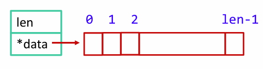

定义结构体：

```cpp
typedef struct{
    long len;
    data_t *data; // 基本元素的数据类型
}vec_rec, *vec_ptr;

typedef long data_t; // 基本元素的数据类型
```

创建一个vec_ptr并返回：

```cpp
vec_ptr new_vec(long len){
	vec_ptr result = (vec_ptr)malloc(sizeof(vec_rec));
	data_t *data = NULL;
    if (!result) return; // 如果分配失败, 直接返回
    if (len > 0){
        // 动态分配数组calloc, 指定data_t大小的len个空间
        // 数组中初始值都为0
        data = (data_t*)calloc(len, sizeof(data_t));
        if (!data){ // 分配失败, 释放结构体
            free((void *)result);
            return NULL:
        }
    }
    result->data = data; // 分配成功, 让指针指向数组
    return result;
}
```

访问向量元素：

```cpp
int get_vec_element(vec_ptr v, long index, data_t *dest){
    if (index < 0 || index >= v->length) return 0; // 边界检查, 不符合要求返回0
    *dest = v->data[index]; // 将找到的值赋给dest
    return 1; // 查询成功, 返回1
}
```

确定向量长度：

```cpp
long vec_length(vec_ptr v){
	return v->length;
}
```

### 代码优化

示例功能：使用某种运算，将向量中的所有元素合并一个值

```cpp
// 对向量元素求和
#define IDENT 0
#define OP +

// 对向量元素求乘积
#define IDENT 1
#define OP *
```

#### 合并运算的初始实现

```cpp
void combine1(vec_ptr v, data_t *dest){
	long i;
	*dest = IDENT;
	for (int i = 0; i < vec_length(v); i++){
		data_t val;
		get_vec_element(v, i, &val); // 将取得的值赋给val
		*dest = *dest OP val; // 进行运算
	}
}
```

| 函数     | 方法    | 整数           | 浮点数         |
| -------- | ------- | -------------- | :------------- |
|          |         | +            * | +            * |
| combine1 | 未优化  | 22.68    20.02 | 19.98  20.18   |
| combine1 | **-O1** | 10.12    10.12 | 10.17  11.14   |

在未进行任何代码优化的时候，只是依靠编译器的优化，性能就可以提升一倍

#### 优化一：消除循环的低效率

在初始实现的代码中，每次循环都要进行函数调用，但向量的长度不会随着循环的进行而改变。因此，只需要计算一次向量长度即可。

```cpp
void combine2(vec_ptr v, data_t *dest){
    long i;
    long length = vec_length(v); // 只调用一次vec_length(v), 数据存储在length中
    *dest = IDENT;
    for(i = 0; i < length; i++){
        data_t val;
        get_vec_elemrnt(v, i, &val);
        *dest = *dest OP val;
    }
}
```

| 函数     | 方法               | 整数           | 浮点数         |
| -------- | ------------------ | -------------- | :------------- |
|          |                    | +            * | +            * |
| combine1 | **-O1**            | 22.68    20.02 | 19.98  20.18   |
| combine2 | 移动**vec_length** | 10.12    10.12 | 10.17  11.14   |

编译器通过一些基本的优化改善了**combine1**的性能，但未解决更深层次的性能瓶颈，即重复调用**vec_length(v)**

那么，编译器为什么不能将**vec_length(v)**从循环出调用呢？

1.函数可能有副作用。例如，每次调用都改变全局变量/状态

2.对于给定的参数，函数可能返回不同的值。如果函数依赖外部变量或者循环中改变的变量，它每次的返回值可能会有所不同。因此，编译器无法确定将**vec_length(v)**移除循环的正确性

3.在代码中,**vec_length(v)**可能与其它函数交互，导致**vec_length(v)**需要在每次循环中重新计算，而不是提前计算一次

对于编译器：

1.函数调用被视为*黑盒*

2.编译器只会尝试在函数附近进行弱优化

解决办法：

1.使用**inline**内联函数

2.程序员自己做代码移动 

#### 优化二：减少过程调用

我们修改**get_vec_element**，无需边界检查，直接获取**data**数组

```cpp
// 直接获取data数组
data_t* get_vec_start(vec_ptr v){
    return v->data;
}

void combine3(vec_ptr v, data_t *dest){
	long i;
	long length = vec_length(v);
	data_t *data = get_vec_start(v);
	*dest= IDENT;
	for (i= 0; i<length; i++){
		*dest= *dest OP data[i];
	}
 }
```

缺点是破坏了程序的模块性。我们并不知道他的元素到底是以数组存储还是链表之类的存储

| 函数     | 方法               | 整数           | 浮点数         |
| -------- | ------------------ | -------------- | :------------- |
|          |                    | +            * | +            * |
| combine2 | 移动**vec_lemgth** | 7.02    9.03   | 9.02  11.03    |
| combine3 | 直接访问**data**   | 7.17    9.02   | 9.02  11.03    |

性能没有明显的提升，整体求和的性能还略有下降。说明是循环的其他操作形成了瓶颈。

#### 优化三：消除不必要的内存引用

注意到，代码每次循环都更新***dest**。即每一次都要从内存读取数据，执行**OP**操作后写回内存

```cpp
void combine4(vec_ptr v, data_t *dest){
 	long i;
 	long length = vec_length(v);
	data_t *data = get_vec_start(v);
	data_t acc = IDENT;
	for (i = 0; i <length; i++){
		acc = acc OP data[i];
	}
	*dest = acc;
}
```

现在，每次迭代的内存操作从两次读取和一次写减少到只需要一次读

我们将总和临时存储在读写速度更高的寄存器，最后一起写入内存

| 函数     | 方法               | 整数           | 浮点数         |
| -------- | ------------------ | -------------- | :------------- |
|          |                    | +            * | +            * |
| combine2 | 移动**vec_length** | 7.02    9.03   | 9.02  11.03    |
| combine4 | 直接访问数据       | 1.27    3.01   | 3.01  5.01     |

那么，编译器为什么不能自动将combine3优化为combine4？

是因为，之前提到的**内存别名引用**

例如，在v->data=[2，3，5]的时候，我们将向量**v**的最后一个元素与存放结果的目标之间创建了一个别名，然后再进行累乘的操作：

```cpp
 combine3(V, get_vec_start(V)+2);
 combine4(V, get_vec_start(V)+2);
```

| 函数     | 初始值    | 循环之前  | i = 0     | i = 1     | i = 2      | 最后       |
| -------- | --------- | --------- | --------- | --------- | ---------- | ---------- |
| combine3 | [2，3，5] | [2，3，1] | [2，3，2] | [2，3，6] | [2，3，36] | [2，3，36] |
| combine4 | [2，3，5] | [2，3，5] | [2，3，5] | [2，3，5] | [2，3，5]  | [2，3，30] |

编译器无法判断函数在上面情况下被调用，以及程序员的本意是什么

编译combine3时，保守的方法是不断的读和写内存

编程时，编写对编译器友好的代码

## 5.4 理解现代处理器

在上述的优化中。Combine2、3、4的优化均不依赖机器的特性

若要进一步优化，就必须了解计算机系统结构与处理器知识

理解计算机的流水线结构和处理器的工作方式对进一步的优化非常重要，尤其是 **指令流水线**

代码级上，看似是一次执行一条指令。实际上，硬件可以并行执行多个指令

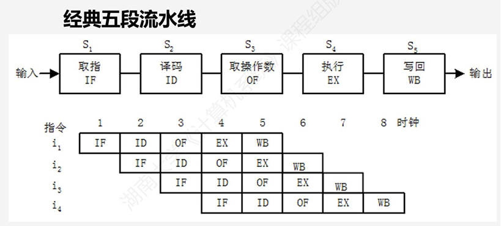

### 超标量处理器

1. **超标量**：每个时钟周期可以乱序执行多个操作（执行顺序和代码顺序不一致）

2. 大多数现代CPU都是超标量处理器

3. 超标量处理器分为两个部分：**指令控制单元(Instruction Control Unit，ICU) **和**执行单元（Execution Unit，EU）**

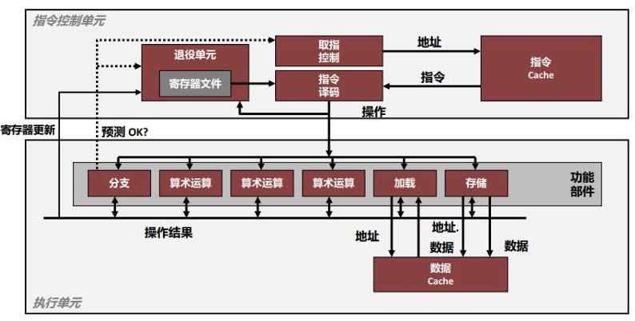

#### 指令控制单元

1. 从指令Cache中读取指令，指令译码将指令转换成一组基本操作（微操作），每个操作都完成简单的操作。

2. 取值通常采用预取的方式，即当前执行的这条指令很早之前就取址，使其有足够的时间译码。

3. 取值控制包含预测分支功能：

   (1) 分支预测、投机执行：不管条件是否正确就执行，但结果不放入寄存器者内存

   (2) 预测错误会带来额外的性能开销

4. 退役单元：记录正在进行的处理，并确保它遵循机器级程序的顺序语义

5. 指令信息被放置在一个先进先出的队列中，出队的情况：

   (1) 指令操作完成，且引起这条指令的分支点也都被预测认为正确，所有对程序寄存器的更新都可被实际执行了。

   (2) 引起该指令的某个分支点预测错误，该指令会被清空，丢弃所有计算出来的结果

6. 任何程序寄存器的更新都只会在指令退役时发生

#### 执行单元

执行单元接收来自取值单元的操作，并将操作分配到一组**功能单元**中

1. 加载/存储单元：读/写内存（单元有个加法器算地址）
2. 算数运算单元：能够执行不同的操作
3. 分支单元：确定预测是否正确。若错误，EU丢弃分支后的计算结果，并将信号发给取值控制，说预测错误，并指出正确分支。

##### 功能单元：以Haswell架构的CPU为例

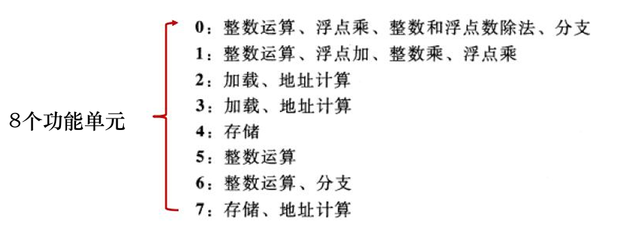

##### 功能单元的性能

1. **延迟**：完成功能所需要的总时间，表明执行实际操作需要的时钟总周期数

2. **发射时间**：两个连续同类型的运算之间的需要的最小时间，即两次运算之间间隔的最小周期数

3. **吞吐量**：单位时间内执行的操作数量

   ​		计算：若有多个功能单元，如**C**个，发射时间为**I**，吞吐量为**C / I**

4. **容量**：能执行该运算的功能单元的数量，表明同时能发射多少个这样的操作

Haswell参考机的功能单元的性能：

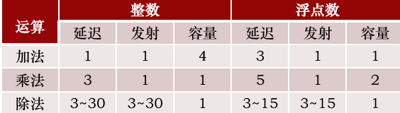

以combine函数为例，我们用CPE值两个基本界限来描述这种影响

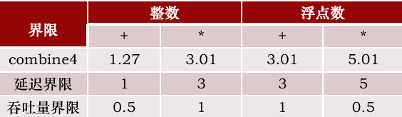

1. **延迟界限**：给出了**任何必须按照严格顺序完成合并运算的函数所需的**最小CPE值
2. **吞吐量值**：给出了**CPE**的最小界限
3. 除了整数加法外，这些测量值与处理器的延迟界限是一样的，它表明这些函数的性能是由所执行的求和或者乘积计算所主宰的，但**仍然大于吞吐量界限，所以可以继续优化**

##### combine4：串行计算的方法

```cpp
for (i = 0; i < length; i++) {
	acc = acc OP data[i];
}
```

1. **顺序依赖性的性能**：由**OP**的延迟决定

2. **CPE**：

   ​	n个元素的乘积或者和，需要**L * n + K**个时钟周期

   ​	**L**是合并运算的延迟，**K**表示调用函数和初始化以及终止循环的开销

   ​	**CPE等于延迟界限L**

#### 处理器操作的抽象模型

程序的**数据流（data-flow）**表示：分析机器及程序性能的工具

以图形化的表示方法，展示了不同操作之间**数据相关**是如何限制它们的执行顺序的

这些限制形成了数据流图中的**关键路径**，是执行一组机器指令所需时钟周期的一个下界

##### 从机器代码到数据流图

```cpp
void combine4(vec_ptr v, data_t  *dest)
 {  ……
 data_t acc = 1;
 for (i = 0; i < length; i++){
 acc = acc * data[i];
 }
 *dest = acc;
 }
```

**combine4**的汇编代码为：

```asm
data_t=double, OP=*
acc in %xmmo0, data+i in %rdx, length in %rax

.L25
	vmulsd (%rdx), %xmm0, %xmm0	// 乘法操作
	addq  $8, %rdx 	// 指向下一个数据元素
	cmpq %rax, %rdx	// 比较i < length
	jne .L25	//如果i < length, 跳转至.L25
```

其中，**%rdx**指向当前元素的地址，**%rax**指向数组的长度，**%xmmo**指向**acc**

由此可得到数据流图：

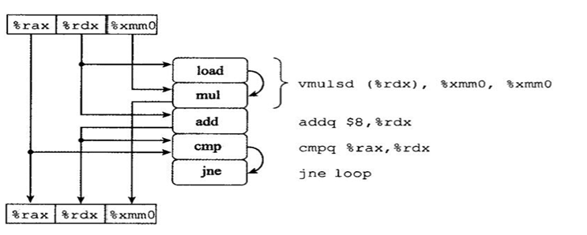

 对数据流图进行修改，上方寄存器只有**只读寄存器**和**循环寄存器**，下方寄存器只有**只写寄存器**和**循环寄存器**

​	**只读**：只用作源值（作为数据也可以作为地址），但在循环中不会被修改

​	**只写**：作为数据传送操作的的目的（本例无只写寄存器）

​	**局部**：在循环内部被修改和使用，但在迭代与迭代之间不相关 （条件寄存器）

​	**循环**：既作为源值，又作为目的，一次迭代中产生的值会在另一次迭代中用到（**%rdx, %xmm0**）

同时出现在上方和下方的寄存器为循环寄存器，我们**删除寄存器以外的寄存器，并删除不在循环寄存器之间的操作**，得到简化的数据流图

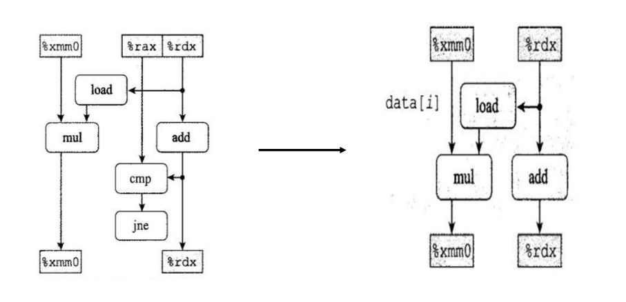

然后，我们再将数据流图循环展开：

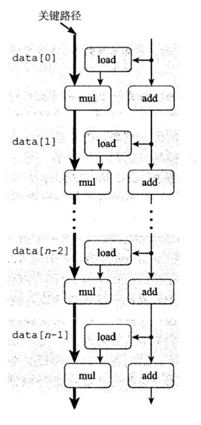

由此，我们得到了两条相关链

1. mul操作修改的acc
2. add操作修改的data + i

假设浮点乘法延迟为五个周期，整数假发延迟为一个时钟周期，那么：

**左边的数据相关链会称为关键路径，浮点乘法器成为了制约资源**

换言之，在**combine4**中，指针移动的消耗相对较少，而**乘法操作**成为了性能瓶颈

#### 循环展开一：减少关键路径的循环次数

循环展开是一种程序变换，通过增加每次迭代计算的元素的数量，减少循环迭代次数

它可以从两个方面提升程序的性能：

1. 减少了不直接有助于程序结果的操作数量，如循环所以计算，分支条件
2. 提供了一些方法，可以进一步变化代码，减少整个计算中关键路径上的操作

对**combine4**进行**2 * 1**循环展开

```cpp
void combine5(vec_ptr v, data_t  *dest) // 循环每次处理数组中的两个元素
 {
  long i;
  long length = vec_length(v);
  long limit = length -1;
  data_t *data = get_vec_start(v);
  data_t acc = IDENT
  for (i = 0; i < limit; i+=2){
    acc = (acc OP data[i]) OP data[i+1];
  }
  for(;i<length;i++)
  acc = acc OP data[i];
  *dest = acc;
 }
```

循环展开的效果：

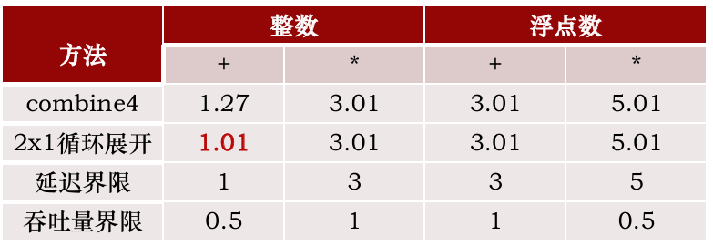

1. **整数加法达到延迟界限**：减少了循环的开销
2. **其它操作没能改进**：**数据的顺序依赖限制了性能的提升**。

#### 提高并行性

##### 循环展开二：实现程序并行

分析**combine5**的性能瓶颈：

1. 将累计值放在一个单独的变量**acc**中，使其在前面的计算完成之前，都不能计算**acc**的新值
2. 无法充分利用硬件资源（如流水线、多个算数运算单元等）

解决办法：

1. 将一组合并运算**分割成两个或更多的部分**，并在最后合并结果来提高 性能
2. 前提：运算是可结合和可交换的
3. 整数加法、乘法满足交换和结合律，浮点数加法、乘法不满足

使用两个变量分别计算奇元素和偶元素的累加结果（**2 * 2**循环展开）：

```cpp
void combine6(vec_ptr v, data_t  *dest)
 {
  long i;
  long length = vec_length(v);
  long limit = length -1;
  data_t *data = get_vec_start(v);
  data_t acc0 = IDENT;
  data_t acc1 = IDENT;
  for (i = 0; i < limit; i+=2){
    acc0 = acc0 OP data[i];   //偶元素
    acc1 = acc1 OP data[i+1]; //奇元素
  }
  for(;i<length;i++)
 	acc0 = acc0 OP data[i];
  *dest = acc0 OP acc1;
 }
```

新的汇编代码：

```asm
# i in %rdx, limit in %rbp, acc0 in %xmm0,acc1 in %xmm1 data address in %rax
 .L35
   vmulsd (%rax, %rdx,8), %xmm0, %xmm0
   vmulsd 8(%rax, %rdx,8), %xmm1, %xmm1	// 可见这里多使用了一个寄存器
   addq $2, %rdx
   cmpq %rdx, %rbp
   jg  .L35
```

1. 同样有两个**vmulsd**运算，但这些指令被编译成读写不同的寄存器，且**%xmm0、%xmm1**之间没有**数据相关**。
2. 处理器不再需要等待前一个加法或乘法操作完成，即可开始新的操作

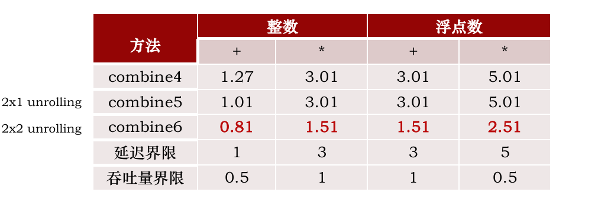

所有的情况都得到了改进，打破了**延迟界限**

**k * k**循环：将循环展开**k**次，以及并行累计**k**个值（**k**个**for**循环，每个循环**k**个**acc**）

当**k**足够大，程序在所有情况下几乎都能达到吞吐量界限

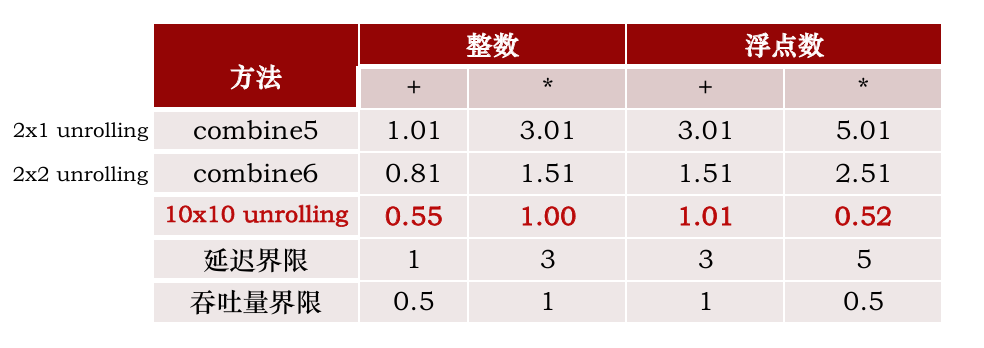

##### 重新结合变换

改变合并执行的方式，以提高程序的性能（**2 * 1a**循环展开）

```cpp
void combine7(vec_ptr v, data_t  *dest){
	…………
	data_t acc = IDENT
	for (i = 0; i < limit; i += 2){
    	acc = acc OP (data[i] OP data[i + 1]);
	…………
}
```


#### 一些限制因素

1.  数据流图中的关键路径指明了执行该程序所需时间的下界

​	若程序中某条关键数据相关链，链上所有的延迟之和等于**T**，则程序至少需要**T**个周期

2. 功能单元的吞吐量界限也是程序执行时间的一个下界

​	程序共需要**N**个某种运算的计算，而处理器只有**C**个能执行这个操作的 功能单元，且功能单元的发射时间为**I**

​	则程序的执行时间至少为**N*I/C**个周期

##### 寄存器溢出Spilling

1. **X86-64**有**16个**整数寄存器，**16**个**ymm**寄存器保存浮点数 

2. 若程序的并行度**P**超过了可用寄存器的数量，会导致寄存器溢出
3. 将临时值存放在内存，运行时在堆栈上分配空间
4. 程序必须从**内存**中读取两个数值：累计变量的值和**data[i]**的值 
5. 计算完成后再将结果保存回**内存**中
6. **内存**的访问效率远低于**寄存器**

##### 分支预测和错误处罚

#### 理解内存性能

##### 加载的性能

##### 存储的性能

##### 写读相关

#### 应用：性能提高的技术

#### 确认和消除性能瓶颈

## 5.5 章节小结

