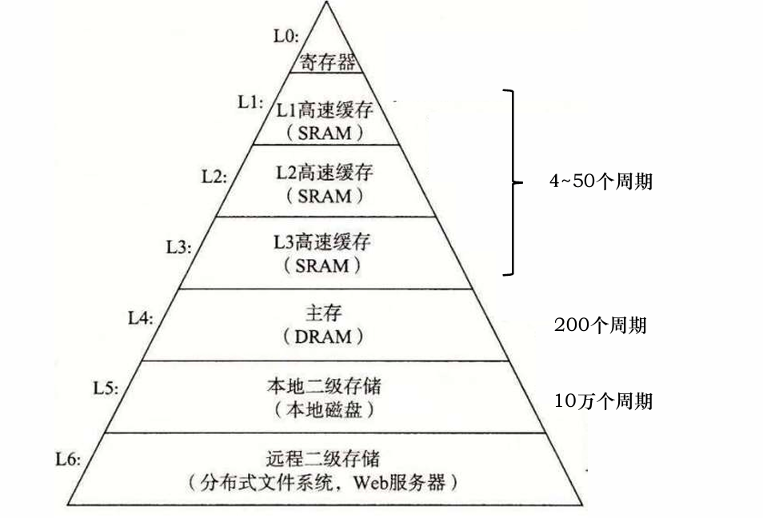
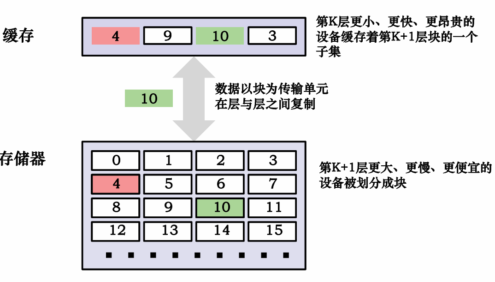
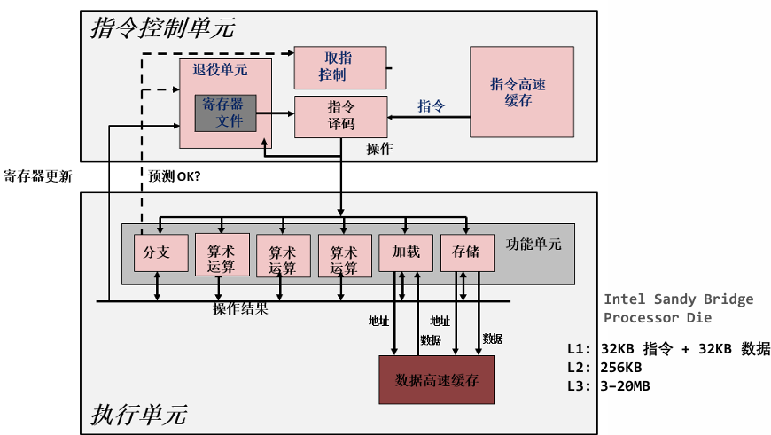

# 第六章 存储器层次结构

## 6.1 存储器

### 6.1.1 存储器的分类

### 6.1.2 随机访问存储器（Random Access Memory，RAM）

#### StaticRAM（SRAM）

#### DynamicRAM（DRAM）

### 6.1.3 只读存储器（Read Only Memory，ROM）

#### 机械磁盘（Hard Disk Drive,  HDD）

#### 固态硬盘（Solid State Drive，SSD）

### 6.1.4 层次性存储结构



**从上至下：存储速度越来越慢、存储容量越来越大，单位价格越来越低**

## 6.2 局部性

**局部性原理（Principle of Locality）**：程序倾向使用**最近一段时间**，**距离其较近地址**的指令和数据

**时间局部性（Temporal Locality）**：当前被访问的信息**近期**很可能还会被再次访问

**空间局部性（Spatial Locality）**：在最近的将来将用到的信息很可能在**空间地址**上是临近的

### 6.2.1 局部性示例

```cpp
sum = 0;
for (i = 0; i < n; i++)  
	sum += a[i];
return sum;
```

**对数据的引用：**

​	顺序访问数组元素（步长为1的引用模式）——**空间局部性**

​	变量**sum**在每次迭代循环中被引用一次——**时间局部性**

**对指令的引用：**

​	顺序读取指令——**空间局部性**

​	重复循环执行for循环体——**时间局部性**

### 6.2.2 对局部性的定性评价

关于数据**a**，分析下列函数的局部性好坏

代码1：

```cpp
int sum_array_rows(inta[M][N]){
	int i, j, sum =0;
	for (i = 0; i < M; i++)  
		for (j = 0; j < N;j++)
			sum += a[i][j];  
	return sum;
 }
```

代码2：

```cpp


int sum_array_cols(inta[M][N]){
    int i, j, sum =0;
	for (j = 0; j < N; j++)  
		for (i = 0; i < M;i++)
			sum += a[i][j];  
    return sum;
 }
```

**行优先**的访问顺序和C语言的**行主页**的内存布局一致，它有良好的空间局部性

然后，我们继续来看看另外一个例子：

修改循环的顺序，使得它以步长为**1**的引用模式扫描三维数组**a**（从而具有良好的局部性）？

```cpp
int sum_array_3d(int a[M][N][P]){
	int i, j, k, sum = 0;
	for (i = 0; i < M; i++)  
		for (j = 0; j < N; j++)
 			for (k = 0; k < P; k++)
				sum += a[k][i][j];
	return sum;
}
```

结果是显而易见的：

```cpp
int sum_array_3d(int a[M][N][P]) {
    int i, j, k, sum = 0;
    for (i = 0; i < M; i++)  
        for (j = 0; j < N; j++)
            for (k = 0; k < P; k++)  // P 是最内层维度，连续
                sum += a[i][j][k];
    return sum;
}
```

## 6.3 缓存（Cache）


存储器的基本思想：

​	对于每个**k**，位于**k**层的更快更小存储设备作为位于**k + 1**层的更大更慢存储设备的**缓存**

### 缓存（Cache）的基本概念



**缓存命中**： 需要的数据块在缓存中找得到，无需访问下层存储器即可获得数据

**缓存不命中**：

1. **冷（强制型）不命中**

​	当缓存为空时，对任何数据的请求都会不命中，此类命中称为冷不命中

2. **容量不命中**

​	发生在当活跃集合（工作集合working set）的大小比缓存大

​	简单地说，就是缓存不够大，，装不下要用的所有东西

3. **冲突不命中**

​	根据映射策略，大多数缓存将**k + 1**层的某个块限制放置在第**k**层块的一个很小的子集中

​	缓存够大，但你访问的数据因为映射策略的问题，全都跑到一个小位置上互相冲突

## 6.4 高速缓存存储器

**高速缓存存储器**是小型的、快速的基于SRAM的存储器，是在硬件中集中管理的



那么就是出现了一个问题：信息从主存流向Cache中，如何进行定位呢？

**地址映射：**CPU访问时，将贮存地址按照某种映射函数关系变成Cache的地址

​	地址映射的方式：**直接映射、组相联映射、全相连映射**

### 直接映射

### 组相联映射

### 全相联映射

